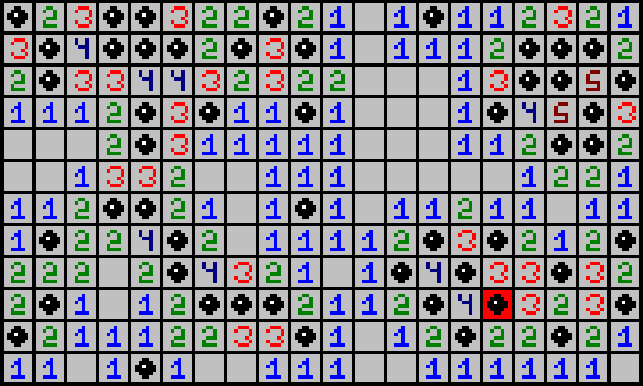

# Minesweeper

This is an implementation of Minesweeper using ConsoleGameEngine. Game configuration is customazible via source code (the first few lines determine field size, number of mines, etc).
All sprites were made using ConsoleSpriteEditor.

*Requires "ConsoleGameEngine.h"*