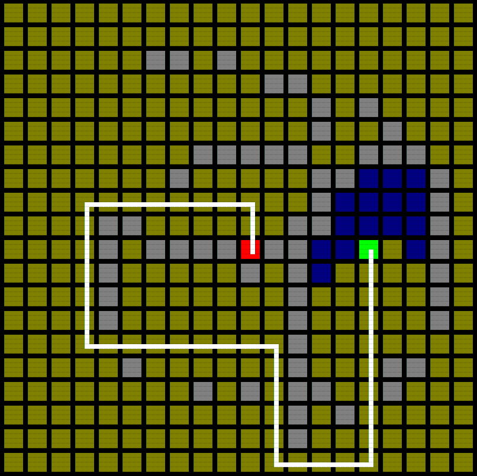

# Pathfinding

Those 4 projects are visualizations of the most common pathfinding algorithms, namely Breadth First Search, Greedy Best First Search, Dijkstra's Algorithm, and A\* Algorithm. All 4 demos are completely the same except for the algorithms themselves, which is a great way to compare each algorithm's performance and accuracy.

*Requires "ConsoleGameEngine.h"*
