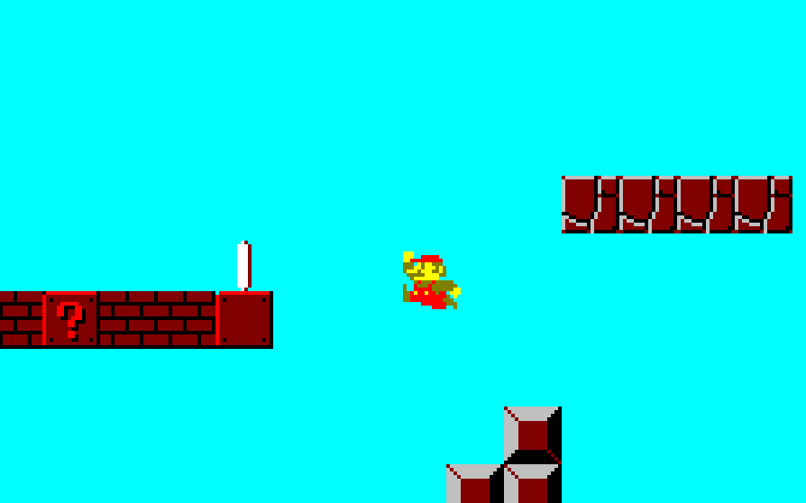

# Simple Platformer

I wanted to experiment a bit with the Engine's capabilities, and so I created a very basic platformer game. It introduces some new techniques, such as more advanced collision detection system and physics, dynamic moving camera, animations, and audio. It's also written in a more object-oriented style and makes use of polymorphism.

*Requires "ConsoleGameEngine.h"*